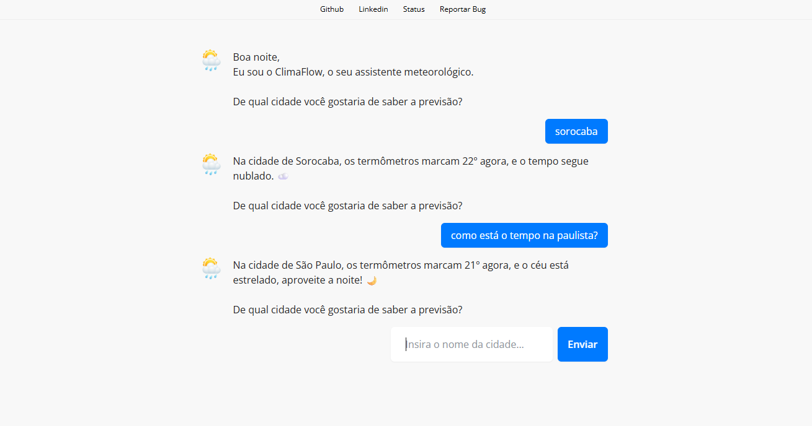
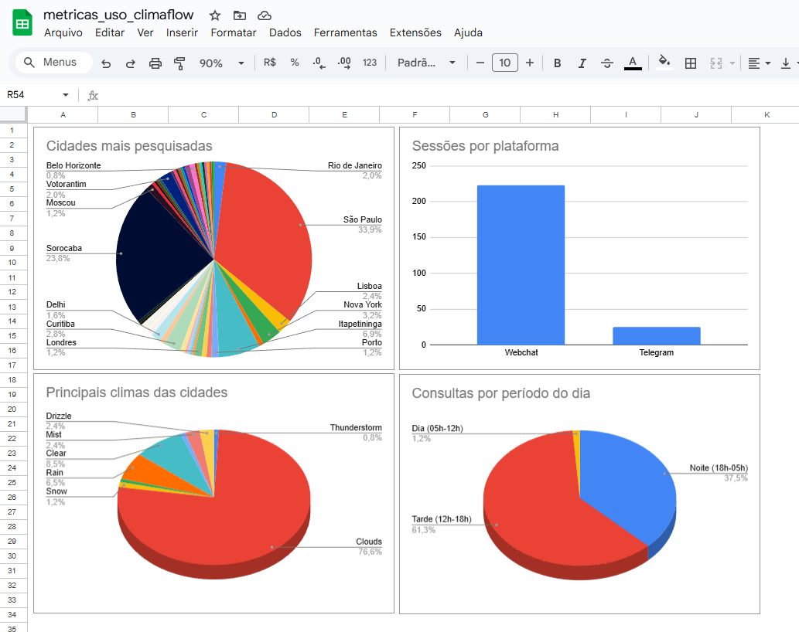
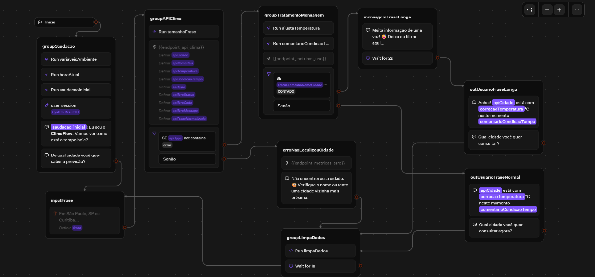
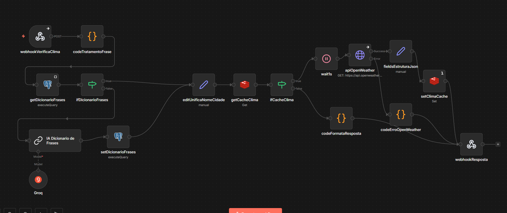
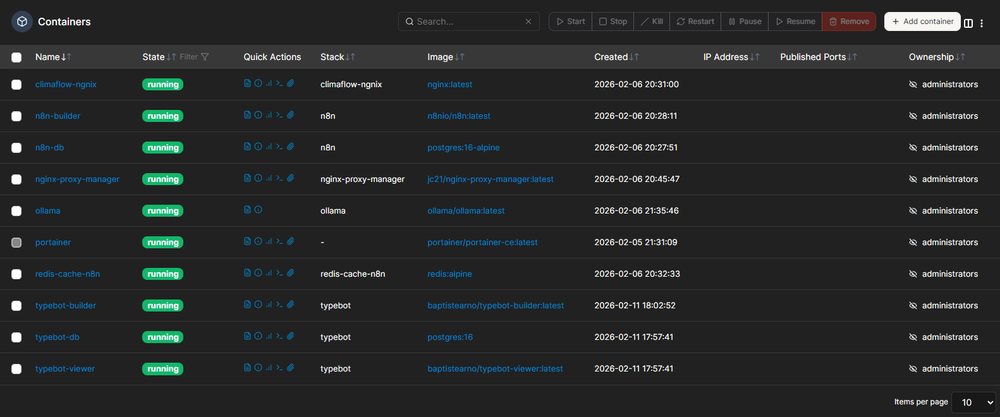
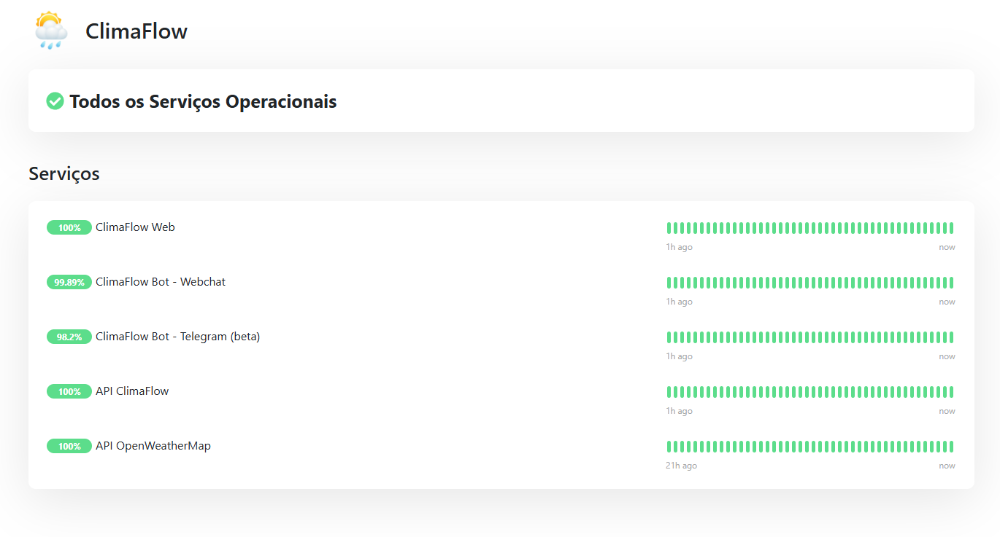

# 🌦️ ClimaFlow Assistente Meteorológico

O **ClimaFlow** é uma solução de assistência meteorológica que une interfaces conversacionais intuitivas com uma arquitetura de back-end. Evoluindo de um fluxo simples para um ecossistema baseado em **Inteligência Artificial Generativa** e automação via **n8n**, o projeto demonstra a integração entre desenvolvimento, IA e operações de infraestrutura moderna.

👉 **Demonstração:** [climaflow.settebyte.com](https://climaflow.settebyte.com/)

---

## 🛠️ Arquitetura e Tecnologias

### **Back-end & Inteligência**
* **Motor de Automação:** [n8n](https://n8n.io/) (Self-Hosted)(Orquestração de workflows e lógica).
* **Processamento de Linguagem Natural (NLP):** IA Generativa (Groq/Anthropic) para Extração de Entidades (NER), permitindo que o bot entenda cidades dentro de frases.
* **Performance:** [Redis](https://redis.io/) para cache de alta velocidade, otimizando o consumo da API meteorológica.
* **Persistência de Dados:** [PostgreSQL](https://www.postgresql.org/) para gestão de dicionários de intenções e [Google Sheets](https://www.google.com/sheets/about/) para métricas em tempo real.
* **API de Clima:** [OpenWeather API](https://openweathermap.org/).

### **Front-end & Interface**
* **Interface Conversacional:** [Typebot](https://typebot.io/) (Self-Hosted)(UI/UX do chat).
* **Landing Page:** HTML5/CSS3 com design responsivo.

### **Infraestrutura (Self-Hosted)**
* **Cloud:** Oracle Cloud Infrastructure (OCI).
* **Orquestração:** Docker & Portainer.
* **Rede:** Nginx Proxy Manager (Proxy Reverso e SSL) + Cloudflare (DNS & WAF).
* **Observabilidade:** Uptime Kuma para monitoramento de disponibilidade.
* **CI/CD:** GitHub Actions para deploy automatizado.

---

## 🚀 Funcionalidades Chave

-   **Extração Inteligente (NLP):** O ClimaFlow utiliza IA para identificar o local desejado mesmo em frases como: *"Como está o tempo na paulista?"*.
-   **Otimização/Performance:** Implementação de camada de cache que evita chamadas redundantes a APIs externas para a mesma localização num curto período.
-   **Interação Contextual:** Lógica personalizada para saudações baseadas no fuso horário do usuário.
-   **Métricas:** Monitoramento de cidades mais pesquisadas, climas, temperaturadas e frases.

---

## 📸 Demonstração

| Interface de Webchat | Métricas |
| :---: | :---: |
|  |  |

| Workflow Typebot | Workflow n8n |
| :---: | :---: |
|  |  |

| Portainer | Status |
| :---: | :---: |
|  |  |
